<!-- DEFENSE_PRESENTATION_CONTENT_FA_R2 (۲۰۲۶-۱۰-۰۷، درخواست نویسنده).
     همان فهرست موضوعاتِ R1، اما این بار آماده برای ساختِ دستیِ پاورپوینت:
       ۱) شکل‌ها زیرِ هر اسلاید داخل خودِ فایل ورد گذاشته شده‌اند (کپی-پیست مستقیم)؛
       ۲) شماره‌گذاری و بودجهٔ زمانی با هم یکی شدند (۲۸ اسلاید + پشتیبان)؛
       ۳) اسلایدِ صحت‌سنجیِ مکانیکی/حرارتی با شکل‌های فصل ۴-۴ اضافه شد؛
       ۴) بخش «راهنما و پیشنهاد برای ساخت پاورپوینت» اضافه شد؛
       ۵) اسلایدهای پشتیبان با شکل‌های اصلاح‌شدهٔ ۴-۵ و ۴-۸ اضافه شد.
     عددها از فصل ۵ و چکیده نقل شده؛ عددهای اصلی (۱٫۱۱۵، ۰٫۰۳۴، ۰٫۶۹۲، ۸ برابر،
     ۲٫۵ برابر، ۲۶ برابر، ۰٫۹۲۶، ۱۵ برابر) با فصل ۵ تطبیق داده شد.
     مسیر ساخت: مسیر شکل‌ها نسبت به همین پوشه (claude/defense/) نوشته شده؛
     pandoc باید از همین پوشه اجرا شود وگرنه شکل‌ها بی‌صدا حذف می‌شوند. -->

<!-- (پایان یادداشت ساخت)
     R1 منجمد. -->

# محتوای آمادهٔ پاورپوینتِ جلسهٔ دفاع

**نحوهٔ استفاده:** بخش «الف» فهرستِ موضوعاتی است که باید در ارائه باشد. بخش «ب» متنِ آمادهٔ هر اسلاید است — عنوان، بولت‌ها و شکل. بولت‌ها و شکل را مستقیم در پاورپوینت کپی کنید؛ «یادداشت ارائه» را **روی اسلاید نگذارید** و در بخش Notes پاورپوینت بنویسید. بخش «ج» پیشنهادهای ساخت و ارائه است.

---

# بخش الف — موضوعاتی که باید در ارائه باشد

## الف-۱. بودجهٔ زمانی (۱۸ تا ۲۰ دقیقه)

| بخش | اسلایدها | تعداد | زمان |
|---|---|---|---|
| عنوان و فهرست | ۱–۲ | ۲ | ۱ دقیقه |
| مقدمه: مسئله، هدف، پیشینه و شکاف | ۳–۵ | ۳ | ۳ دقیقه |
| مدل‌سازی: هندسه، مواد، الگوها | ۶–۹ | ۴ | ۳ دقیقه |
| معادلات حاکم و روش حل | ۱۰–۱۳ | ۴ | ۳ دقیقه |
| صحت‌سنجی و همگرایی | ۱۴–۱۷ | ۴ | ۳ دقیقه |
| نتایج و بحث | ۱۸–۲۴ | ۷ | ۵٫۵ دقیقه |
| نوآوری، نتیجه‌گیری، محدودیت‌ها، تشکر | ۲۵–۲۸ | ۴ | ۱٫۵ دقیقه |
| **جمع** | | **۲۸** | **۲۰ دقیقه** |

> قاعدهٔ سرانگشتی: هر اسلاید حدود **۴۰ ثانیه**. اسلایدِ شکل‌دار کمی بیشتر، اسلایدِ متنی کمتر. اسلایدهای پشتیبان در زمان حساب نمی‌شوند.

## الف-۲. اقلامِ الزامی

- [ ] **اسلاید عنوان:** عنوان کامل، نام نگارنده، استاد راهنما، استاد مشاور، دانشگاه و دانشکده، تاریخ دفاع.
- [ ] **فهرست مطالب.**
- [ ] **بیان مسئله:** چرا مهم است؟ چه چیزی ناکافی است؟
- [ ] **هدف پژوهش:** یک تا سه جملهٔ دقیق و قابل‌سنجش.
- [ ] **پیشینه و شکاف تحقیقاتی:** چه شده و جای خالی کجاست.
- [ ] **هندسه و فرضیات مدل:** شکل، ابعاد، شرایط مرزی، بارگذاری.
- [ ] **معادلات حاکم:** فقط معادلات کلیدی.
- [ ] **روش حل:** چرا این روش و مزیتش چیست.
- [ ] **صحت‌سنجی:** مقایسهٔ کمّی با مرجع یا حل دقیق. **هرگز حذف نکنید** — نخستین چیزی است که داور می‌پرسد.
- [ ] **همگرایی:** شبکه و گام زمانی کافی‌اند.
- [ ] **نتایج:** هر نتیجه = یک شکل + یک پیام روشن.
- [ ] **نوآوری‌ها:** صریح و شماره‌دار.
- [ ] **نتیجه‌گیری:** پاسخ به هدفی که در اسلاید ۴ گفتید.
- [ ] **محدودیت‌ها:** خودتان بگویید؛ اگر داور اول بگوید، امتیاز منفی است.
- [ ] **پیشنهادهای آینده.**
- [ ] **تشکر و پرسش.**
- [ ] **اسلایدهای پشتیبان (Backup)** پس از اسلاید پایانی، برای پاسخ به پرسش‌ها.

## الف-۳. قواعد نمایشی

- هر اسلاید **یک پیام**؛ عنوان اسلاید همان پیام باشد، نه یک برچسب خنثی.
- حداکثر **۵ تا ۶ بولت**، هر بولت حداکثر **دو سطر**.
- روی اسلایدِ شکل متن کم بگذارید؛ توضیح را شفاهی بدهید.
- قلم بدنه کمتر از **۲۰pt** نباشد؛ محور و راهنمای شکل‌ها خوانا باشند.
- شمارهٔ اسلاید را نشان دهید (داور هنگام پرسش به آن ارجاع می‌دهد).
- عددهای کلیدی را **پررنگ** کنید.

---

# بخش ب — محتوای هر اسلاید

---

## اسلاید ۱ — عنوان

**عنوان روی اسلاید:**

تحلیل ترموالاستیک استوانه‌های متخلخلِ تقویت‌شده با پلاکت‌های گرافنی تحت بارِ ترمو-مکانیکی با استفاده از تئوری لرد-شولمن

**زیرنویس‌ها (جای‌نگهدارها را پر کنید):**

- نگارنده: ‹نام دانشجو›
- استاد راهنما: ‹نام استاد راهنما›
- استاد مشاور: ‹در صورت وجود›
- ‹نام دانشگاه و دانشکده› — ‹تاریخ دفاع›

---

## اسلاید ۲ — فهرست مطالب

- بیان مسئله و هدف پژوهش
- پیشینه و شکاف تحقیقاتی
- مدل‌سازی: هندسه، مواد و الگوها
- معادلات حاکم و روش حل عددی
- صحت‌سنجی و همگرایی
- نتایج و بحث
- نوآوری‌ها، نتیجه‌گیری و پیشنهادها

---

## اسلاید ۳ — بیان مسئله

**عنوان:** چرا تئوری کلاسیک فوریه کافی نیست؟

- تئوری فوریه سرعت انتشار حرارت را **بی‌نهایت** فرض می‌کند.
- این فرض در **شوک حرارتی و زمان‌های کوتاه** غیرفیزیکی است.
- تئوری لرد-شولمن با زمان تخفیف $\tau_0$ معادلهٔ انرژی را **هذلولوی** می‌کند: حرارت به‌صورت **موج با سرعت محدود** منتشر می‌شود.
- استوانه‌های جدارضخیمِ گرافنی و متخلخل در مخازن تحت فشار، محفظه‌های احتراق و سامانه‌های حفاظت حرارتی به کار می‌روند.

**یادداشت ارائه:** با یک جملهٔ ملموس شروع کنید: «اگر جدارهٔ یک مخزن در چند ثانیه ۳۰۰ درجه گرم شود، مدل کلاسیک عملاً می‌گوید اثرِ آن بلافاصله به سطح بیرونی می‌رسد — که فیزیکی نیست.»

---

## اسلاید ۴ — هدف پژوهش

- حلِ **کاملاً ممزوجِ** معادلات لرد-شولمن برای استوانهٔ توخالیِ **چندلایهٔ متخلخلِ تقویت‌شده با گرافن**.
- بررسی **دما، تنش، کرنش و جابجایی** در فضای دوبعدی $(r,z)$.
- کمّی‌سازی اثر **الگوهای پنج‌گانهٔ** توزیع گرافن و تخلخل (UD, O, X, V, A).
- مقایسهٔ **چهار تئوری** ترموالاستیسیته و تعیین محدودهٔ واگرایی آن‌ها.
- ارائهٔ یک **توصیهٔ طراحی** برای حفاظت حرارتی.

---

## اسلاید ۵ — پیشینه و شکاف تحقیقاتی

- مطالعات پیشین عمدتاً: هدایت **کلاسیک فوریه**، یا حل **غیرممزوج**، یا هندسهٔ **یک‌بعدی**.
- اثر گرافن و تخلخل غالباً **جداگانه** بررسی شده است.
- **شکاف:** حل ممزوج لرد-شولمن برای استوانهٔ چندلایهٔ متخلخلِ گرافنی در دو بُعد، به‌همراه **ماتریس کاملِ برهم‌کنش الگوها**.
- این پژوهش دقیقاً همین شکاف را پر می‌کند.

**یادداشت ارائه:** این اسلاید جایی است که «چرا کار شما تازه است» را اثبات می‌کنید. نام دو سه مرجعِ نزدیک را آماده داشته باشید و تفاوتتان را در یک جمله بگویید.

---

## اسلاید ۶ — هندسهٔ مسئله

- استوانهٔ توخالی، $N_L=7$ لایه، خواص متغیر در ضخامت.

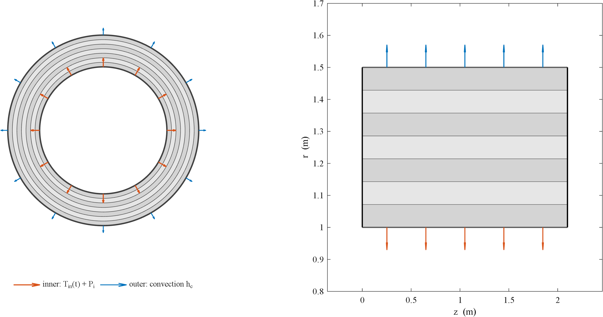{width=13cm}

---

## اسلاید ۷ — حالت مرجع و شرایط مرزی

- ابعاد: $R_i=1$ m، $R_o=1.5$ m، طول $L=2.1$ m.
- بار حرارتی: سطح داخلی $300 \to 600$ K؛ سطح خارجی همرفت با $h_c=10$ W/m²K.
- بار مکانیکی: فشار داخلی $P_i=50$ MPa؛ انتهاها تکیه‌گاه ساده و عایق حرارتی.
- زمان تخفیف $\tau_0=418$ s، معادل $\tau^*\approx 0.15$؛ زمان کل ۳۰۰۰ ثانیه.
- خواص الاستیک: **هالپین-تسای** + قانون مخلوط‌ها؛ تخلخل: مدل **سلول باز**.

---

## اسلاید ۸ — الگوهای توزیع گرافن

- پنج الگو: UD (یکنواخت)، O، X، V (تمرکز در سطح داخلی)، A (تمرکز در سطح خارجی).

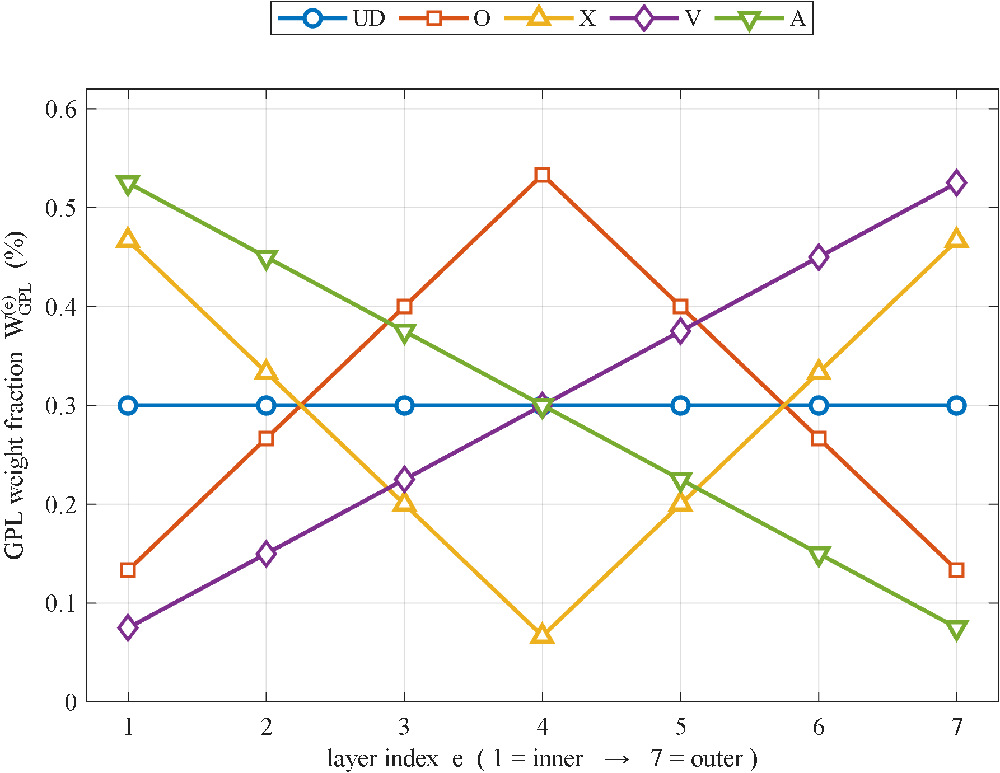{width=14cm}

---

## اسلاید ۹ — الگوهای توزیع تخلخل

- همان پنج الگو، این بار برای توزیع تخلخل در ضخامت.

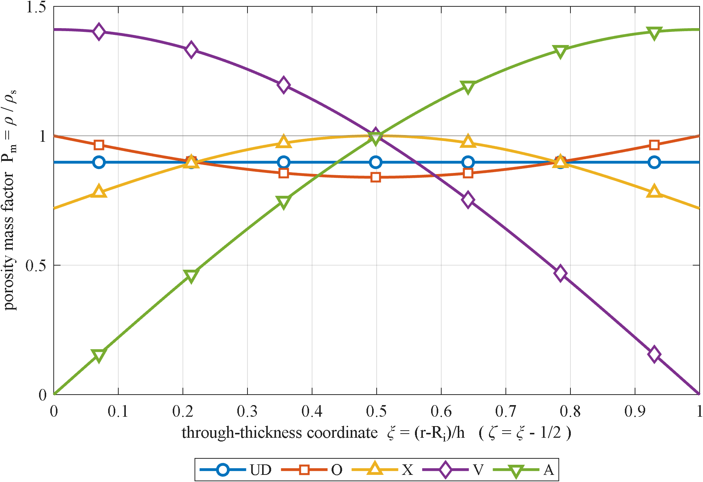{width=14cm}

**یادداشت ارائه:** تأکید کنید V و A **آینهٔ یکدیگرند** — این نکته بعداً در یافتهٔ هم‌افزایی کلیدی می‌شود.

---

## اسلاید ۱۰ — معادلات حاکم

**معادلهٔ انرژی لرد-شولمن:**

$$\rho c\left(\dot{\theta} + \tau_0\ddot{\theta}\right) + \beta T_0\left(\dot{e} + \tau_0\ddot{e}\right) = \nabla\cdot(k\nabla\theta)$$

- جملهٔ $\tau_0\ddot{\theta}$ معادله را **هذلولوی** می‌کند ← موج با سرعت $C=\sqrt{\alpha/\tau_0}$.
- جملهٔ $\beta T_0\dot{e}$ **پیوند ممزوج** میان دما و تغییرشکل است.
- معادلات حرکت شعاعی و محوری با جملهٔ تنش حرارتی $\beta\theta$.
- $\tau_0 \to 0$ معادله را به **فوریهٔ کلاسیک** فرو می‌کاهد.

**یادداشت ارائه:** فقط همین یک معادله را نشان دهید. اگر جزئیات استخراج را خواستند، اسلاید پشتیبان (فصل ۳) را باز کنید.

---

## اسلاید ۱۱ — روش حل عددی

- **مکان:** مربعات تفاضلی (DQM) به‌صورت **لایه‌ای** در $(r,z)$ با نقاط چبیشف-گاوس-لوباتو.
- **زمان:** انتگرال‌گیر نیومارک ($\beta=1/4$، $\gamma=1/2$) — بدون قید پایداری.
- شرایط مرزی و **سازگاری بین‌لایه‌ای** (پیوستگی دما، شار، جابجایی و تنش) به‌صورت سطرهای جبری اعمال می‌شوند.
- **مزیت کلیدی:** DQM در هر راستا حدود **۱۵ برابر** نقطهٔ کمتر از تفاضل محدود و اجزای محدود خطی نیاز دارد.

---

## اسلاید ۱۲ — شبکهٔ DQM

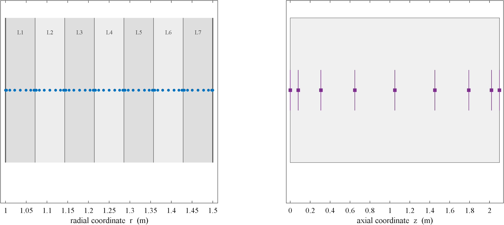{width=14cm}

---

## اسلاید ۱۳ — فلوچارت حل

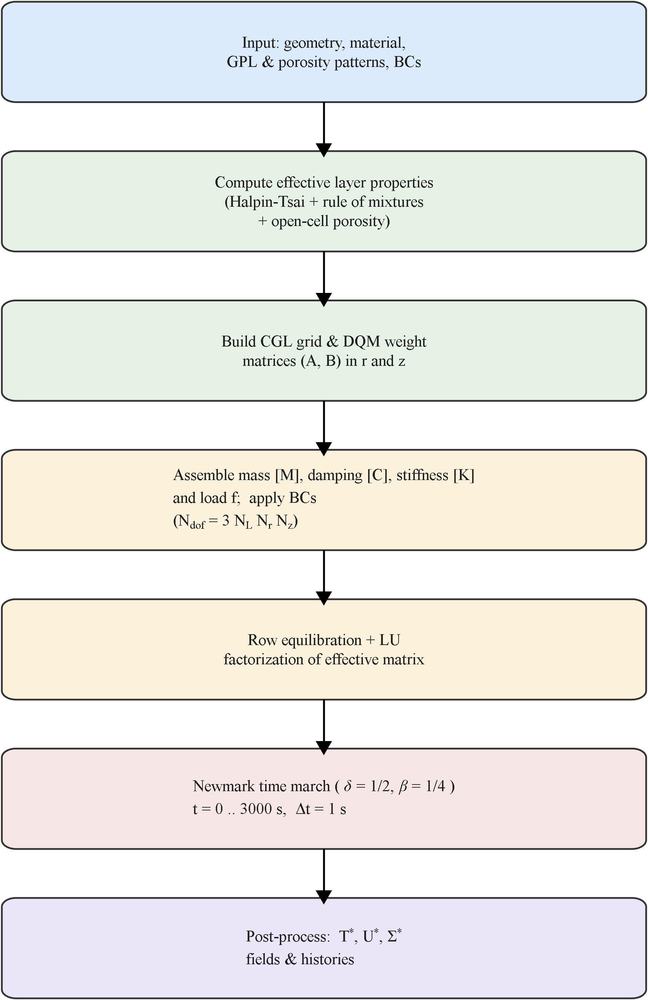{width=13cm}

**یادداشت ارائه:** اگر زمان کم است، اسلایدهای ۱۲ و ۱۳ را در یک اسلاید ادغام کنید (شبکه در بالا، فلوچارت کوچک در پایین) یا فلوچارت را به پشتیبان ببرید.

---

## اسلاید ۱۴ — صحت‌سنجی: پنج آزمون

1. **حد استاتیکی** — انطباق با مونتاژ استاتیکی مستقل: اختلاف نسبی $\sim 2\times10^{-11}$.
2. **پاسخ مکانیکی** — مقایسه با ملک‌زاده (جدول ۶ مرجع [۳۱]) و ANSYS: اختلاف **۰٫۱ تا ۰٫۲٪**.
3. **هدایت گذرا** — حل دقیق سری بسل: خطای $10^{-5}$ تا $10^{-7}$.
4. **انتگرال‌گیر زمانی** — مقایسه با `ode15s`: اختلاف **۰٫۰۰۳ K**.
5. **موج صوت دوم** — صحت‌سنجی **کمّی** در برابر حل دقیق تحلیلی.

**یادداشت ارائه:** این اسلاید مهم‌ترین سپرِ دفاعی شماست. آرام و با اعتمادبه‌نفس بخوانید.

---

## اسلاید ۱۵ — صحت‌سنجی مکانیکی و حرارتی (نمونهٔ شکل‌ها)

- **آزمون ۲:** جابجایی شعاعی بی‌بعد سطح داخلی در برابر زمان؛ حل حاضر، مرجع و ANSYS.
- **آزمون ۳:** پروفیل شعاعی دما در چند زمان؛ حل حاضر (نشانگرها) در برابر حل دقیق بسل (خط پیوسته).

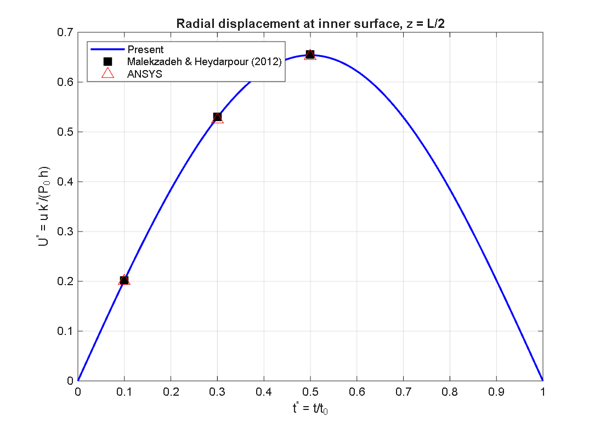{width=12cm}

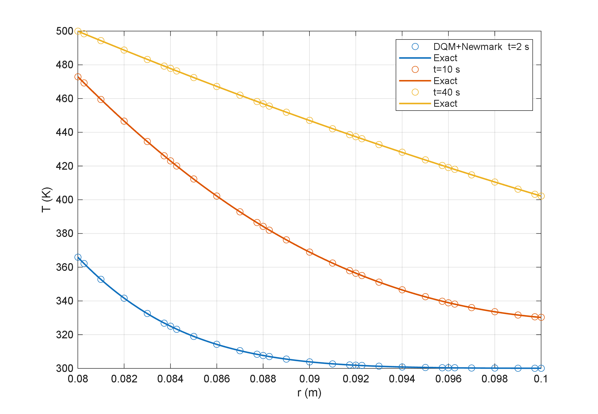{width=12cm}

**یادداشت ارائه:** این دو شکل را کنار هم در یک اسلاید بگذارید (دو ستون). شکل‌های آزمون ۱ و ۴ در اسلایدهای پشتیبان‌اند.

---

## اسلاید ۱۶ — صحت‌سنجی کمّی موج صوت دوم

- مرجع: **حل دقیق تحلیلی** برای همین هندسه (بسط ویژه‌تابع فوریه-بسل؛ هر مُد یک نوسانگر میرا با حل بسته — بدون گسسته‌سازی زمانی).
- خطای حل‌گر: **۰٫۳۲٪** ($L_\infty$) و **۰٫۰۶۵٪** ($L_2$).
- خطا با ریزسازی شبکه **یکنواخت کاهش** می‌یابد ← نوسان‌های پشت پیشانی اثر **گیبس** است، نه ناپایداری فیزیکی.
- پیشانی موج با دقت **کمتر از یک فاصلهٔ شبکه** ردیابی می‌شود.

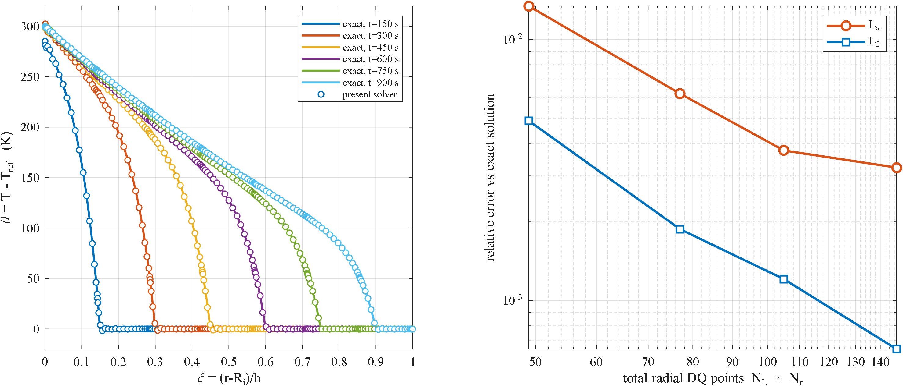{width=15cm}

**یادداشت ارائه:** اگر پرسیدند «چرا مرجع تحلیلی و نه مقالهٔ چاپ‌شده؟» بگویید: حل دقیق برای *همین* هندسه استخراج شده، پس مقایسه بدون خطای رقمی‌سازیِ شکلِ مرجع و بدون اختلاف در فرضیات انجام می‌شود.

---

## اسلاید ۱۷ — همگرایی شبکه

- مش قفل‌شده: $N_r=15$، $N_z=11$، $N_L=7$.
- راستای **محوری** راستای مقیدکننده است.

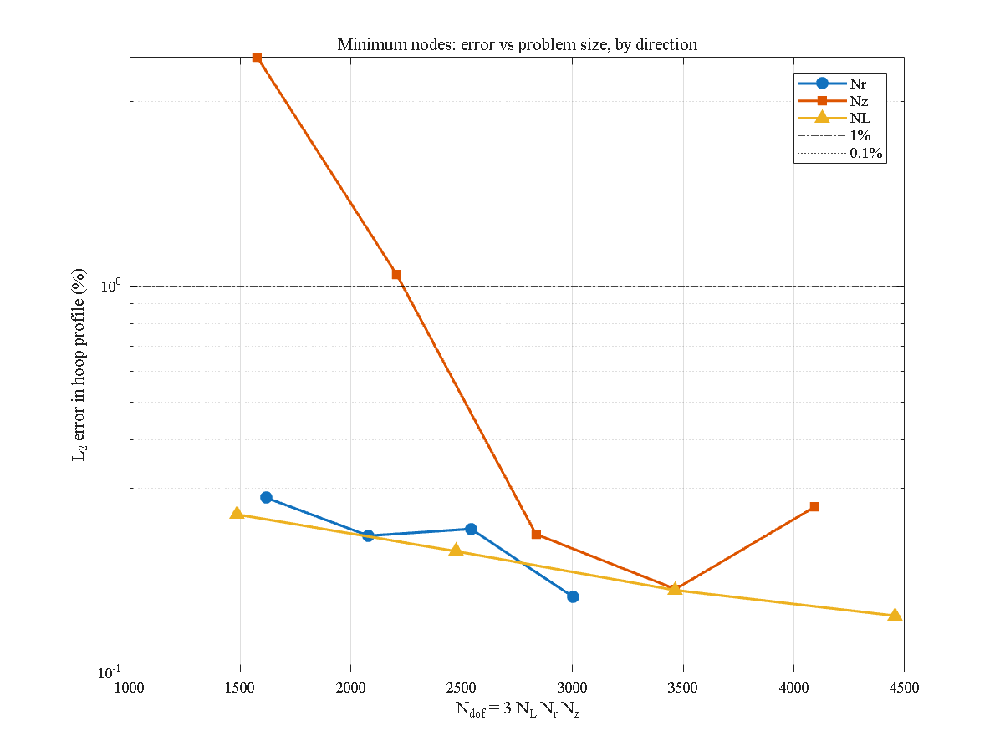{width=15cm}

---

## اسلاید ۱۸ — نتیجه ۱: موج حرارتی و فراجهش دما

- دمای میان‌جداری می‌تواند از مقدار محرک **فراتر رود**: تا **۱٫۱۱۵** در کسر وزنی بالای گرافن و **۱٫۱۰۹** در تخلخل الگوی V.
- تاریخچهٔ دما الگوی **«قله-قعر»** ناشی از بازتاب موج را نشان می‌دهد.
- در مدل کلاسیک این رفتار اساساً **قابل بازتولید نیست**.

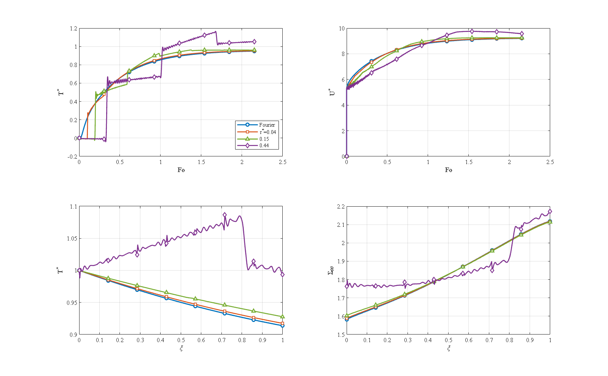{width=15cm}

---

## اسلاید ۱۹ — نتیجه ۲: اثر الگوی گرافن

- **الگوی V** (گرافن رسانا در سطح داخلیِ گرم): بیشینهٔ دما حدود **۲۹٪** کمتر از حالت یکنواخت و تنش محیطی سطح داخلی تا **۳ برابر** کوچک‌تر.
- **الگوی A** تصویر آینه‌ای V و **بدترین** حالت در هر سه کمیت است.

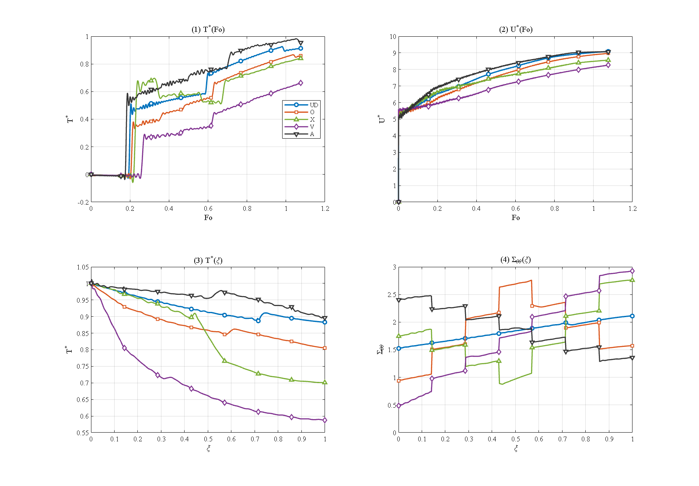{width=15cm}

---

## اسلاید ۲۰ — نتیجه ۳: اثر الگوی تخلخل

- **تخلخل الگوی A** (حفره‌ها در سطح خارجی) مانند **سد حرارتی** عمل کرده و دمای سطح خارجی را تا **۸ برابر** کاهش می‌دهد.
- اما **علامت** تنش محیطی سطح داخلی را نیز وارون می‌کند.
- الگوی V بیشترین قلهٔ گذرا را می‌سازد (**۱٫۱۱**).

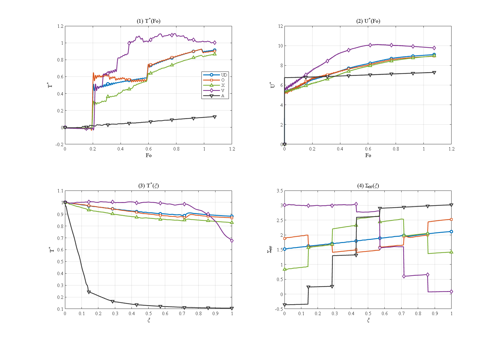{width=15cm}

---

## اسلاید ۲۱ — نتیجه ۴: برهم‌کنش هم‌افزای گرافن و تخلخل ★

- ترکیب **گرافن V** + **تخلخل A** هم‌افزا است: دمای سطح خارجی تا **۲۶ برابر** کاهش می‌یابد، با تنش ملایم.
- ماتریس کامل ۵×۵ نشان می‌دهد الگوهای آینه‌ای می‌توانند:
    - **هم‌افزا** باشند: V-گرافن با A-تخلخل $\to 0.034$
    - یا **خنثی‌کننده**: V-گرافن با V-تخلخل $\to 0.692$
- **هم‌راستایی یا تقابل دو الگو** تعیین‌کننده است، نه انتخاب یک الگوی «خوب».

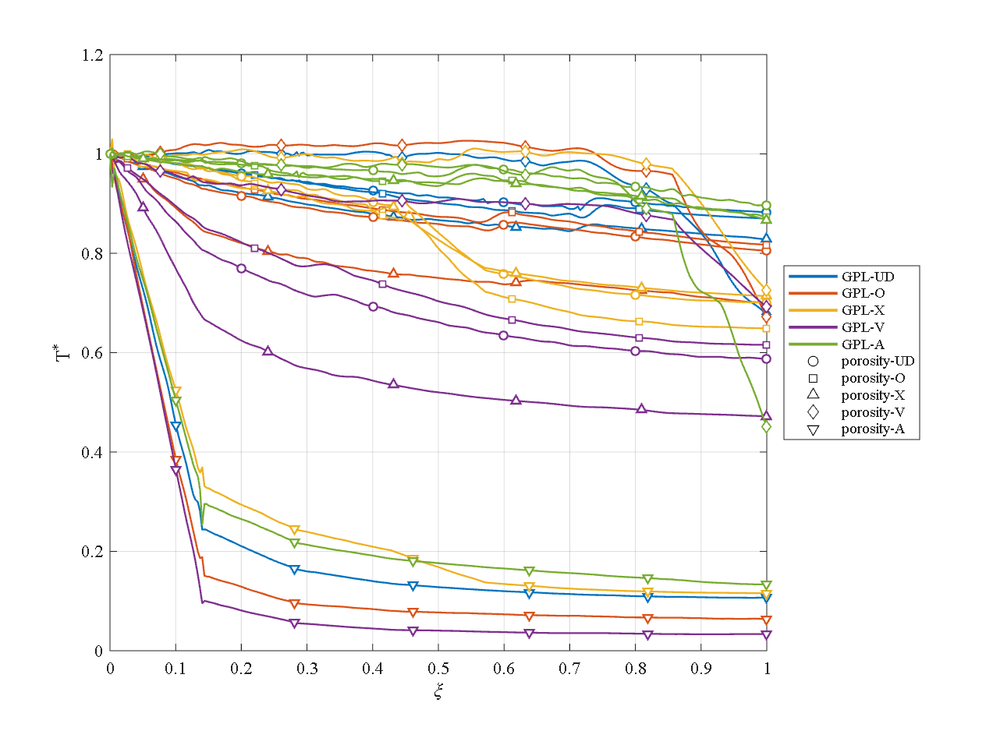{width=15cm}

**یادداشت ارائه:** این **مهم‌ترین یافتهٔ** پایان‌نامه است. اینجا سرعت را کم کنید، جمله‌بندی را دقیق بگویید و توصیهٔ طراحی را صریح اعلام کنید.

---

## اسلاید ۲۲ — نتیجه ۵: کسر وزنی و آستانهٔ پرکولاسیون

- آستانهٔ **پرکولاسیون** حدود کسر وزنی **۱٪**: گذر از «عایق» به «رسانا».
- افزودن گرافن بیشتر، نفوذ حرارتی را فقط **هموار** بهبود می‌دهد اما عمدتاً **تنش حرارتی را می‌افزاید** (دو برابر شدن تنش در ۸٪).
- نسبت‌های ابعادی پلاکت در کسر وزنی مرجع اثر **درجهٔ دوم** دارند (تغییر تنش کمتر از ۲٪).

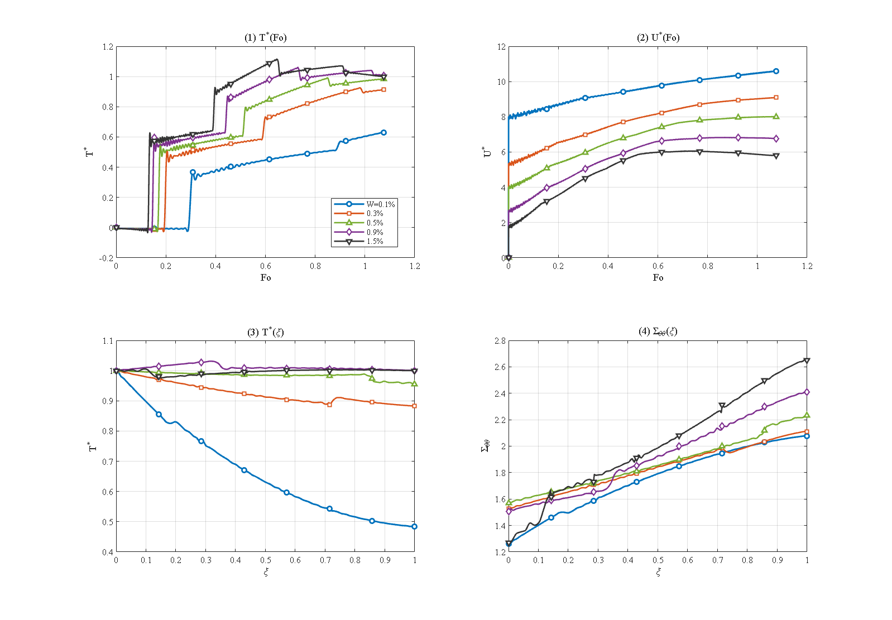{width=15cm}

---

## اسلاید ۲۳ — نتیجه ۶: شوک حرارتی گاوسی

- در بارگذاری **پالس گاوسی**، تئوری کلاسیک بیشینهٔ دما را حدود **۲٫۵ برابر کم‌برآورد** می‌کند.
- یعنی مدل کلاسیک در شوک کوتاه‌مدت **غیرمحافظه‌کارانه** است.
- حل ممزوج، موج حرارتی را حدود **۱٪** میرا می‌کند (میرایی ترموالاستیک).

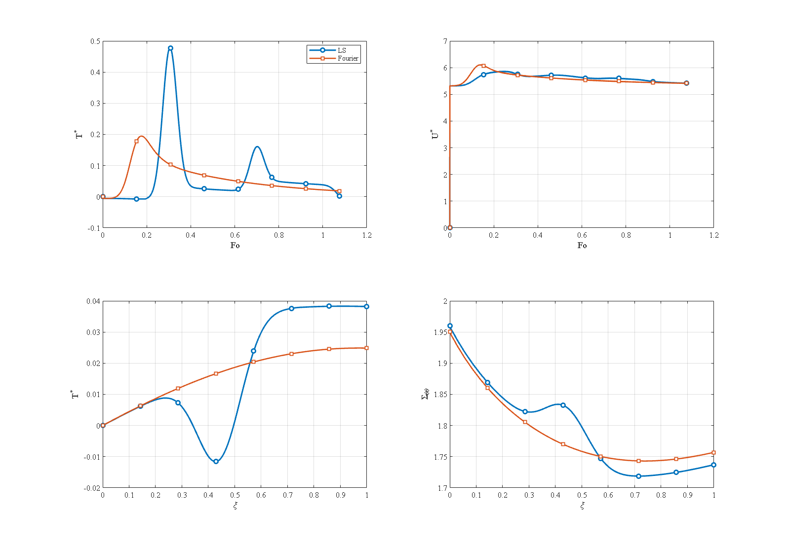{width=15cm}

**یادداشت ارائه:** این قوی‌ترین استدلال شما به سود تئوری تعمیم‌یافته است.

---

## اسلاید ۲۴ — نتیجه ۷: مقایسهٔ چهار تئوری

- فوریه / لرد-شولمن / DPL / گرین-نگدی نوع سوم، با پارامترهای هم‌خوان.
- تباهیدگی DPL در $\tau_T=\tau_q$؛ فراجهش ماندگار گرین-نگدی.

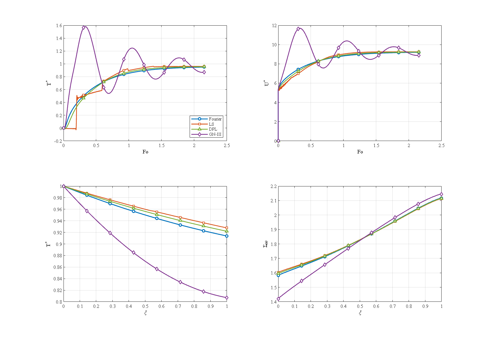{width=15cm}

---

## اسلاید ۲۵ — نوآوری‌های پژوهش

1. حل **کاملاً ممزوج** لرد-شولمن برای استوانهٔ چندلایهٔ متخلخلِ گرافنی به روش DQM لایه‌ایِ دوبعدی.
2. شناسایی **برهم‌کنش هم‌افزای V-گرافن و A-تخلخل** و ارائهٔ **ماتریس کامل ۵×۵** که در مراجع پیشین همتا ندارد.
3. گزارش رفتار **«قله-قعر»** و آینه‌ایِ الگوها و پیوند آن با سرشت موجی هدایت.
4. سه مطالعهٔ گسترشی روش‌شناختی: شش انتگرال‌گیر زمانی، چهار روش گسسته‌سازی مکانی و چهار تئوری ترموالاستیسیته.
5. صحت‌سنجی **کمّی** موج صوت دوم در برابر حل دقیق تحلیلی.

---

## اسلاید ۲۶ — نتیجه‌گیری

- برای تحلیل دقیق **شوک حرارتی گذرا**، تئوری لرد-شولمن **ضروری** است؛ تئوری کلاسیک دما و تنش گذرا را به‌شدت کم‌برآورد می‌کند.
- از دیدگاه طراحی، **هم‌راستاسازی الگوهای گرافن و تخلخل (ترکیب V-A)** بهترین رفتار حرارتی را با کمترین جریمهٔ تنش می‌دهد.
- انتخاب الگو باید **هم‌زمان** از منظر دما و تنش سنجیده شود.
- **DQM لایه‌ای + نیومارک** ابزاری کارآمد و صحت‌سنجی‌شده است.

---

## اسلاید ۲۷ — محدودیت‌ها و پیشنهادها

**محدودیت‌ها**

- خواص مادی **مستقل از دما** فرض شده‌اند.
- مدل **الاستیک خطی**، بدون معیار آسیب/شکست.
- پیوند **کامل** بین‌لایه‌ای (بدون مقاومت حرارتی فصل‌مشترک).

**پیشنهادها**

- وابستگی خواص به دما و رفتار **غیرخطی/آسیب**.
- افزودن **مقاومت حرارتی فصل‌مشترک**.
- **صحت‌سنجی تجربی** و تدوین نمودار طراحی مهندسی بر پایهٔ یافتهٔ V-A.

---

## اسلاید ۲۸ — تشکر

با تشکر از توجه شما — پرسش و پاسخ

---

# اسلایدهای پشتیبان (پس از اسلاید ۲۸؛ در حالت نمایش پنهان شوند)

## پشتیبان ۱ — آزمون ۱: حد استاتیکی

- جابجایی شعاعیِ میان‌مقطع از حل‌گر استاتیکی مستقل در برابر حد استاتیکی حل‌گر دینامیکی؛ دو منحنی بر هم منطبق‌اند.
- ۴۵ نقطهٔ شعاعی؛ بیشینهٔ اختلاف مطلق $2.1\times10^{-14}$ m و نسبی $2.2\times10^{-11}$.

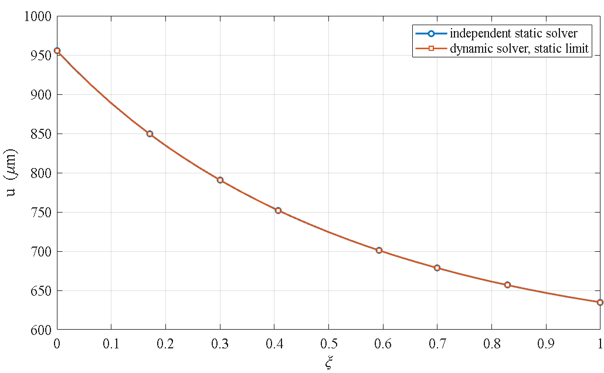{width=12cm}

## پشتیبان ۲ — آزمون ۴: انتگرال‌گیر زمانی

- تاریخچهٔ دمای نقطهٔ میانی برای حل دقیق، نیومارک و `ode15s`؛ هر سه منحنی بر هم منطبق‌اند.
- بیشینهٔ خطا: نیومارک **۰٫۰۰۳۱۹ K**، `ode15s` **۰٫۰۰۰۲۶ K**؛ هزینهٔ نیومارک حدود یک‌دهم.

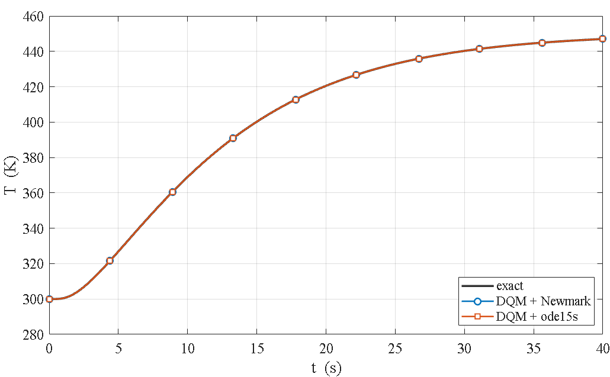{width=12cm}

## پشتیبان ۳ تا ۶ — پیشنهاد برای ساخت (از خودِ پایان‌نامه بردارید)

- **پشتیبان ۳:** جدول خواص مواد و فرمول‌های هالپین-تسای، قانون مخلوط‌ها و سلول باز (فصل ۳).
- **پشتیبان ۴:** معادلات کاملِ حرکت و شرایط مرزی/بین‌لایه‌ای (فصل ۳).
- **پشتیبان ۵:** جدول‌های عددی همگرایی (فصل ۴، بند ۴-۳).
- **پشتیبان ۶:** الگوریتم نیومارک و مقایسهٔ روش‌ها (پیوست الف).

---

# بخش ج — راهنما و پیشنهاد برای ساخت پاورپوینت

## ج-۱. نکتهٔ مهم پیش از دفاع: یک ناهمخوانی در فصل ۵

در فصل ۵، محدودیتِ شمارهٔ ۵ می‌گوید فراجهش موج صوت دوم «تنها به‌صورت **کیفی**» و در برابر باقری و اسلامی صحت‌سنجی شده و «سنجهٔ خطای کمّی گزارش نشده است». اما بند ۴-۴ (آزمون ۵) و اسلاید ۱۶ همین آزمون را **کمّی** و با حل دقیق فوریه-بسل (خطای ۰٫۳۲٪ و ۰٫۰۶۵٪) گزارش می‌کنند. این دو با هم نمی‌خوانند و داورِ دقیق ممکن است همین را بپرسد. پیش از دفاع یکی از دو متن را اصلاح کنید؛ پیشنهاد من: محدودیت ۵ فصل ۵ را با نتیجهٔ کمّیِ آزمون ۵ هماهنگ کنم. (هنوز دست نزده‌ام.)

## ج-۲. طراحی

- **یک قالب ساده:** پس‌زمینهٔ روشن، حداکثر دو قلم (یکی فارسی مثل وزیرمتن/B Nazanin، یکی لاتین مثل Times برای معادله و نمادها). شمارهٔ اسلاید را در گوشه بگذارید.
- **شکل‌ها را بزرگ کنید:** در اسلایدِ شکل، تصویر دست‌کم دوسوم صفحه را بگیرد. راهنمای شکل‌ها (legend) در PNGها با قلم ۱۴ ساخته شده و روی اسلاید باید خوانا بماند؛ اگر شکلی بیش از حد کوچک شد، همان یک شکل را به اسلاید جداگانه ببرید.
- **همهٔ شکل‌های نتایج از یک مجموعه رنگ‌اند** (`figures_ch4_color`)؛ برای هماهنگی فقط از همین پوشه استفاده کنید، نه از نسخه‌های سیاه‌وسفید.
- **جهت صفحه:** متن فارسی راست‌به‌چپ و شکل‌ها چپ‌به‌راست است. در توضیح شکل از «راست/چپ» استفاده نکنید؛ از نام کمیت یا پانل بگویید.
- **معادله را یک‌بار و بزرگ بنویسید:** فقط معادلهٔ انرژی. در پاورپوینت از Insert → Equation استفاده کنید؛ معادله‌های این فایل برای کپی مستقیم به‌صورت معادلهٔ ورد هستند.
- **عددهای فارسی/لاتین:** در یک اسلاید یکی را انتخاب کنید. پیشنهاد: متن با رقم فارسی، معادله و محور شکل با رقم لاتین (مثل پایان‌نامه).
- **انیمیشن:** فقط روی اسلاید ۲۱ (هم‌افزایی V-A) و شاید ۱۶، بولت‌ها را یکی‌یکی ظاهر کنید. بقیه را ثابت بگذارید.

## ج-۳. ارائه

- **اسلایدِ نقشهٔ راه:** در اسلایدهای ۳ تا ۲۴ یک نوار کوچک پایین صفحه بگذارید که بخش جاری را پررنگ نشان دهد (مقدمه، مدل، روش، صحت‌سنجی، نتایج). داوران هر لحظه می‌دانند کجایید.
- **پیام اول، سپس شکل:** هر اسلاید نتیجه را با یک جمله شروع کنید («گرافن V دما را ۲۹٪ کم می‌کند») و بعد شکل را نشان دهید.
- **اسلاید ۲۱ را باید بدون نگاه به متن بتوانید توضیح دهید.** بقیهٔ اسلایدها را با نگاه گذرا.
- **سه بار تمرین با زمان‌سنج:** یک بار با خودتان، یک بار جلوی یک نفر، یک بار شبیه‌سازی کامل با پرسش. هدف ۱۸ تا ۱۹ دقیقه است تا برای پرسش زمان بماند.
- **اگر وقت کم آمد، این‌ها را حذف کنید (به‌ترتیب):** اسلاید ۱۳ (فلوچارت)، ۱۲ (شبکه)، ۲۴ (چهار تئوری)، ۲۲ (کسر وزنی). هرگز: ۱۴، ۱۶، ۲۱، ۲۶.
- **آمادگی برای پرسش:** ۳۷ پرسش و پاسخ آماده در `governance/DEFENSE_QA_FA.md` هست. اسلایدهای پشتیبان را طوری مرتب کنید که با یک کلیک (شمارهٔ اسلاید + Enter) باز شوند.

## ج-۴. فنی و روز دفاع

- **یک نسخهٔ PDF و یک نسخهٔ PPTX** روی فلش و ایمیل خودتان داشته باشید؛ قلم‌ها را داخل فایل جاسازی کنید (Save → Embed fonts) یا اگر ممکن نیست، PDF را ارائه کنید.
- **قالب ۱۶:۹** را قبل از ساخت انتخاب کنید و بعداً عوض نکنید.
- **ویدیو لازم نیست.** اگر خواستید موج حرارتی را متحرک نشان بدهید، یک GIF کوتاه از پروفیل‌های دما در زمان‌های پیاپی کافی است (اختیاری).
- **ظرف ۲۴ ساعت مانده:** اسلاید عنوان (نام‌ها و تاریخ) را پر کنید، شماره‌ها را با فصل ۵ یک‌بار دیگر تطبیق دهید، و ارائه را یک بار روی رایانهٔ محل دفاع باز کنید.

---

# بخش د — عددهای کلیدی (حفظ کنید)

| کمیت | مقدار |
|---|---|
| بیشینهٔ فراجهش دما | **۱٫۱۱۵** (کسر وزنی بالا)، ۱٫۱۰۹ (تخلخل V) |
| دمای بیشینه در حالت مرجع | ۰٫۹۲۶ |
| گرافن V در برابر یکنواخت | دما **۲۹٪** کمتر، تنش تا **۳ برابر** کمتر |
| تخلخل A | دمای سطح خارجی تا **۸ برابر** کمتر |
| هم‌افزایی V-گرافن + A-تخلخل | تا **۲۶ برابر** کاهش (۰٫۰۳۴ در برابر ۰٫۶۹۲) |
| آستانهٔ پرکولاسیون | حدود کسر وزنی **۱٪** |
| تنش در کسر وزنی ۸٪ | حدود **دو برابر** |
| شوک گاوسی: کم‌برآوردِ فوریه | حدود **۲٫۵ برابر** |
| اثر ممزوج بودن | حدود **۱٪** میرایی |
| فشار ۷۰ تا ۱۰۰ MPa | تا حدود **۵۰٪** تنش محیطی داخلی |
| تکیه‌گاه گیردار | جابجایی مقطع میانی حدود **۹٪** کمتر |
| صرفهٔ DQM | حدود **۱۵ برابر** نقاط کمتر |
| خطای صحت‌سنجی موج | **۰٫۳۲٪** ($L_\infty$)، **۰٫۰۶۵٪** ($L_2$) |
| مش قفل‌شده | $N_r=15$، $N_z=11$، $N_L=7$ |
| سرعت موج | $C=\sqrt{\alpha/\tau_0}$، با $\tau^*\approx0.15$ |

---

# بخش ه — پرسش‌های محتمل داور

۳۷ پرسش و پاسخ کامل در `governance/DEFENSE_QA_FA.md` آماده است. این شش را حتماً مرور کنید:

- آیا **فراجهش دما** نقض قانون دوم ترمودینامیک نیست؟
- آن **نوسان‌های پشت پیشانی موج** خطای عددی است یا فیزیک؟
- چرا **DQM** و نه اجزای محدود؟ مش را چگونه قفل کردید؟
- برای تخلخل بهترین الگو **A** است و برای گرافن **V** — آیا تناقض نیست؟
- حل‌گر را **چگونه صحت‌سنجی** کردید؟
- مهم‌ترین **محدودیت‌های** مدل شما چیست؟
